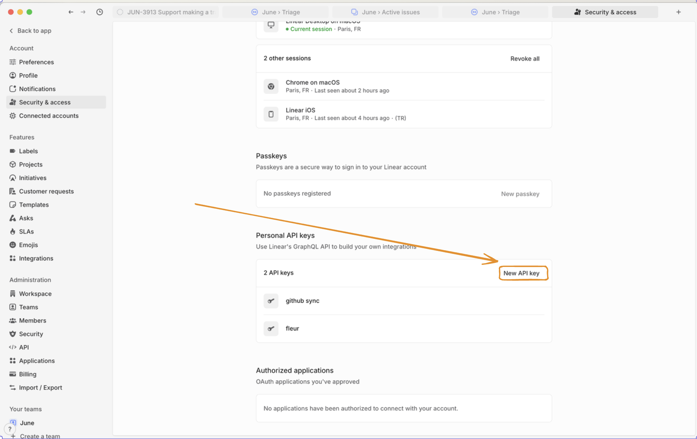

# Linear MCP

A Model Context Protocol (MCP) server for Linear, providing tools for issue tracking and project management.

## Configuration

Go to [Linear security settings](https://linear.app/settings/account/security) and create an API key:



Then, configure it with the `LINEAR_API_KEY` env variable:

```bash
# Add to your .env file
LINEAR_API_KEY=lin_api_xxxxxxxxxxxx

# Or export as environment variable
export LINEAR_API_KEY=lin_api_xxxxxxxxxxxx
```

## Running the Server

```bash
uvx --from git+https://github.com/vinayak-mehta/linear-mcp linear-mcp
```

### Docker
```bash
docker build -t linear-mcp:latest .
docker run -it --rm -e LINEAR_API=lin_api_xxxxxx linear-mcp:latest
```
And to use this in Claude Desktop, it would look like this:
```json
    "linear-mcp-server": {
      "command": "docker",
      "args": [
        "run",
        "-it",
        "--rm",
        "-e",
        "LINEAR_API_KEY=lin_api_xxxxxx",
        "linear-mcp-server:latest"
      ]
    }
```

## Resources

Linear MCP provides access to the following resource types:

| Resource | Description | Example URI |
|----------|-------------|-------------|
| Issue | Details of a specific Linear issue | `linear-issue:///a1b2c3d4` |
| Team Issues | All issues for a specific team | `linear-team:///ENG/issues` |
| User Issues | Issues assigned to a user | `linear-user:///me/assigned` |
| Organization | Details about your Linear organization | `linear-organization:` |
| Viewer | Information about the authenticated user | `linear-viewer:` |

## Tools

| Tool | Description |
|------|-------------|
| `linear_create_issue` | Create a new Linear issue with title, description, and other attributes |
| `linear_update_issue` | Update an existing issue's properties |
| `linear_search_issues` | Search issues using flexible filtering criteria |
| `linear_get_user_issues` | Retrieve issues assigned to a specific user |
| `linear_add_comment` | Add a comment to an existing issue |

## Example Prompts

### Creating a New Issue

```
Create a bug ticket: "Login screen disappears like magic tricks at a birthday party!" Priority: HIGH, Team: Engineering
```

### Updating an Issue

```
Upgrade ENG-123 to "shooting star" priority! Users are excited! Change status to "Racing to the finish line!"
```

### Searching for Issues

```
Find all Frontend tasks with "authentication" that are patiently waiting for their moment to shine
```

### Retrieving User Tasks

```
What exciting challenges await me today in Linear?
```

### Adding a Comment

```
Add to DEV-456: "Temporarily paused while the API does its beauty routine. Back on it next sprint with fresh energy!"
```

### Organization Overview

```
Show me our amazing team structure so I can appreciate all the talented people making this happen
```

## License

Apache 2.0
